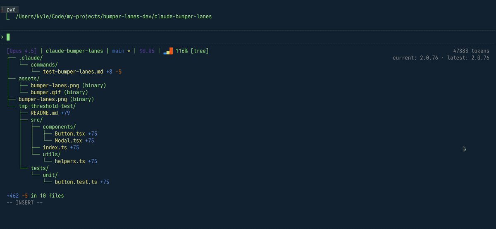

# Bumper Lanes

Bumper lanes gives you two features native to Claude-Code:
1. A 'Heads Up Display' of the changes Claude makes via unique git-diff visualizations in the status line
2. A configurable circuit breaker that blocks Claude from continuing until you review and approve the accumulated changes




## What It Does

Bumper-Lanes tracks how much code Claude has written or edited, blocking further edits when a threshold is exceeded. 600 points corresponds roughly to that many lines of code added, depending on the mix of new files vs edits.

When the threshold is exceeded:

1. **Fuel gauge warnings** show escalating alerts after each Write/Edit (70% NOTICE → 90% WARNING) to you and to Claude
2. **Stop hook** blocks Claude from finishing when threshold exceeded
3. **Reset command** (`/bumper-reset`) restores the budget after you review

## Installation

```bash
claude plugin marketplace add kylesnowschwartz/claude-bumper-lanes
claude plugin install claude-bumper-lanes
```

**Requirements:** Go 1.21+ (binaries are built automatically on first session start)

## Usage

Work normally with Claude. If the configurable threshold is exceeded:

1. Claude will be blocked from continuing
2. Review your changes
3. Optionally commit: `git add -u && git commit -m "message"` (resets the baseline automatically)
4. Or Manually reset the baseline: `/bumper-reset`
5. Continue working with restored budget

## Commands

| Command | Description |
|---------|-------------|
| `/bumper-reset` | Reset baseline after reviewing changes |
| `/bumper-pause` | Pause threshold enforcement (session only) |
| `/bumper-resume` | Resume threshold enforcement |
| `/bumper-config` | Show current configuration |
| `/bumper-config <n>` | Set repo threshold (0=disabled, 50-2000) |

### View Modes

| Command | Description |
|---------|-------------|
| `/bumper-tree` | Indented file tree with +/- stats |
| `/bumper-smart` | Multi-column table sorted by magnitude |
| `/bumper-sparkline-tree` | Rainbow sidebar tree with sparkline bars |
| `/bumper-hotpath` | Hot trail view (follows largest child) |
| `/bumper-icicle` | Horizontal area chart |
| `/bumper-brackets` | Nested `[dir file]` single-line |
| `/bumper-gauge` | Progress gauge showing change magnitude |
| `/bumper-depth` | Nested gauges by depth level |
| `/bumper-heatmap` | Heatmap matrix (rows=dirs, cols=depth) |
| `/bumper-stat` | Native git diff --stat output |

## Status Line Setup

Status line is **auto-configured** on first session. No manual setup needed, though you may want to tweak if you use a custom setup.

If you need to configure manually:

Auto-setup writes this to `~/.claude/settings.json`:

```json
{
  "statusLine": {
    "type": "command",
    "command": "/path/to/.claude/plugins/cache/.../bumper-lanes status",
    "padding": 0
  }
}
```

The path is versioned and changes on plugin updates—auto-setup handles this automatically.

**Want just the diff visualization?** Install [diff-viz](https://github.com/kylesnowschwartz/diff-viz) globally:

```bash
go install github.com/kylesnowschwartz/diff-viz/v2/cmd/git-diff-tree@latest
```

Then use `git-diff-tree` directly in your custom status line scripts. This optionally gives you the tree visualization without the threshold enforcement as well.

### Opting Out of Auto-Setup

To prevent bumper-lanes from modifying your statusline script, add this comment anywhere in your script:

```bash
# BUMPER_HANDS_OFF
```

This tells bumper-lanes to leave your configuration alone. The plugin will not wrap, update, or regenerate any script containing this marker.

## Configuration

Config file: `.bumper-lanes.json` at repo root. Add to `.gitignore` if you don't want to track it.

```json
{
  "threshold": 400,
  "default_view_mode": "tree",
  "default_view_opts": "--width 80 --depth 3",
  "show_diff_viz": true
}
```

| Field | Description |
|-------|-------------|
| `threshold` | Points limit. `0` = disabled, `50-2000` = active (default: 600) |
| `default_view_mode` | Visualization mode (default: tree) |
| `default_view_opts` | Options passed to diff-viz renderer (e.g., `--width 80 --depth 3`) |
| `show_diff_viz` | Show diff visualization in status line (default: true) |

**Available view modes:** tree, smart, sparkline-tree, hotpath, icicle, brackets, gauge, depth, heatmap, stat

**Disabling enforcement:** Set `"threshold": 0` to disable all warnings and blocking while still tracking changes. Useful for exploratory sessions, or if you only want to display the diff tree visual.

**Hiding diff visualization:** Set `"show_diff_viz": false` to hide the diff tree from the status line. Running any view command (`/bumper-tree`, etc.) restores it for the current session.

### Weighted Scoring

- **New file additions**: 1.0x weight
- **Edits to existing files**: 1.3x weight (harder to review)
- **Scatter penalty**: Extra points when touching many files
- **Deletions**: Not counted (removing code is good)

## Requirements

- Go 1.21+ (for automatic binary compilation)
- Git 2.x+
- Claude Code with hooks support

## Project Structure

```
bumper-lanes-plugin/
├── bin/                    # Built binaries (auto-generated)
│   ├── bumper-lanes        # Hook handler
│   └── git-diff-tree       # Diff visualization (from diff-viz)
├── scripts/
│   └── ensure-binaries.sh  # Auto-builds on first run
├── tools/
│   └── bumper-lanes/       # Hook handler source (Go)
├── commands/               # Slash command definitions
└── hooks/
    └── hooks.json          # Hook configuration
```

Diff visualization is provided by [diff-viz](https://github.com/kylesnowschwartz/diff-viz).
